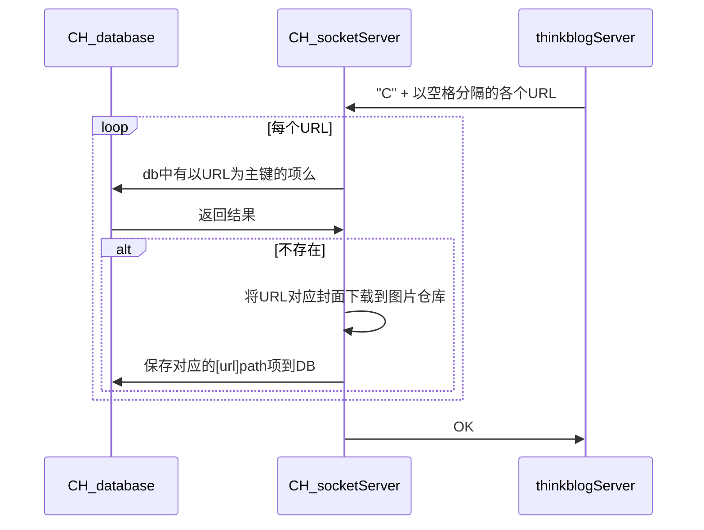
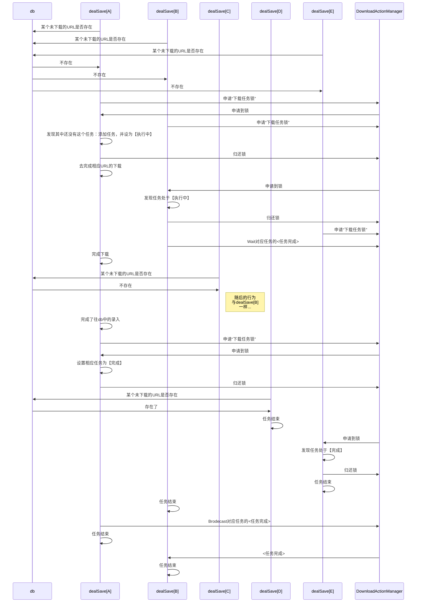

# 1. 创建数据库

保证安装了sqlite3，通过`sqlite3 url2Path.db`，创建一个sqlite数据库。

* 管理员可以给某个条目添加自定义的cover(仅本地上传)，服务器在接受到后将会保存在服务器中。

# A Socket Server

1. 使用sqlite，可配置。
2. 管理的bilibiliCover的保存文件夹；
3. 监听的端口。

## C服务(CHECK)

## 不同的Conn都需要下载同一个URL

